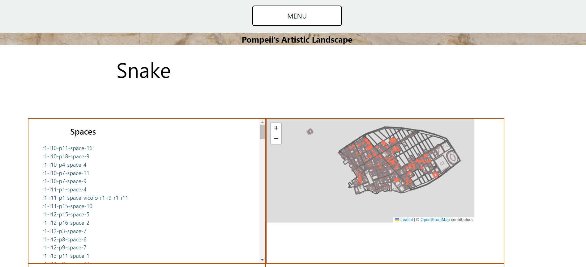

## Pompeii Artistic Landscape Project (PALP) Gatsby app

This is a map-based exploration of the artistic and geographical history of Pompeii, built with Gatsby.  
The app is live at: https://palp-art.netlify.app/start/

## What is PALP?

The Pompeii Artistic Landscape Project (PALP) is an online resource (under construction), based in a Linked Open Data (LOD) format, to encourage sitewide discovery, mapping, analysis, and sharing of information about Pompeian artworks in their architectural contexts.  
  
The goal of PALP is to dramatically increase the number of researchers and members of the public who can access, analyze, interpret, and share the artworks of the most richly documented urban environment of the Roman world: Pompeii.  

[PALP home page](https://palp.p-lod.umasscreate.net)  
[PALP Art page](https://palp.art/start)  
[Pompeii Linked Open Data](https://wp.nyu.edu/archaeohub/non-fieldwork-research/pompeii-linked-open-data/)  

This project was built in collaboration with the directors of PALP: Dr. Eric Poehler from the University of Massachusetts Amherst and Sebastian Heath from the New York University (NYU).

## 🚀 Quick start

git clone this repo

`cd palp-home-gatsby`

`npm i`

`npm run develop`

Open `localhost:8000` on your browser

## 🚀 Online Demo

Check out the [online demo](https://palp-art.netlify.app/start/):

